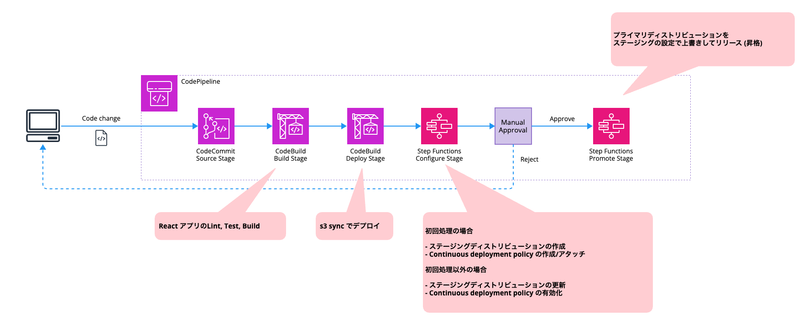

# cdk-cfcd-with-sfn

This is a sample CDK application for CloudFront continuous deployment using CodePipeline.
CloudFront continuous deployment consists of Step Functions.

## Prerequisites

First, define the context as follows:

```json
{
  ...
  "context": {
    ...
    "owner": "user",
    "addresses": ["user@your-domain.jp"],
    "serviceName": "cfcd-test",
    "repositoryName": "test-repo",
    "branch": "main",
    "hostedZoneName": "your-domain.com",
    "buildspecDir": "scripts/build",
  }
}
```

Next, place the version of the application front end in the SSM parameter store as follows:

```sh
$ aws ssm put-parameter --name "/<serviceName>/version/frontend" --value "v1" --type String --overwrite
{
    "Version": 1,
    "Tier": "Standard"
}
```

## Usage

The following command launches a sample pipeline for continuous deployment consisting of a CloudFront distribution, hosting buckets, and Step Functions.

```sh
cdk synth
cdk deploy --all
```

## Pipeline actions


